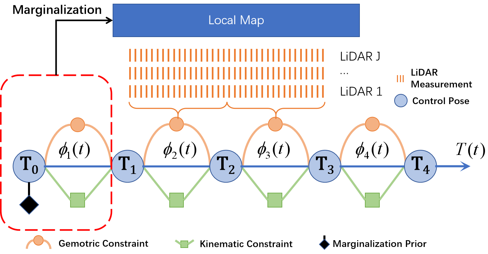

    <h1>Traj-LO</h1>
    <i>A LiDAR-only Odometry from Continuous-Time perspective</i>
     
     
    <a href=https://youtu.be/hbtKzElYKkQ?si=ZlqvtUVhhJbAju0S>Video</a>
    &nbsp;&nbsp;•&nbsp;&nbsp;
    <a href="">Paper</a>
     
     
    
    
 

The spatial-temporal movement of LiDAR is parameterized by a simple yet effective continuous-time trajectory, which consists of multiple piecewise linear functions. 
By coupling the geometric information from streaming LiDAR points and kinematic constraints from trajectory smoothness, it can work even in scenarios where the motion state exceeds the IMU's measuring range.
Besides, the framework is generalized for different kinds of LiDAR as well as multi-LiDAR systems.

### The source code will be uploaded after the paper is accepted. But we will upload the binary package for your testing soon.

